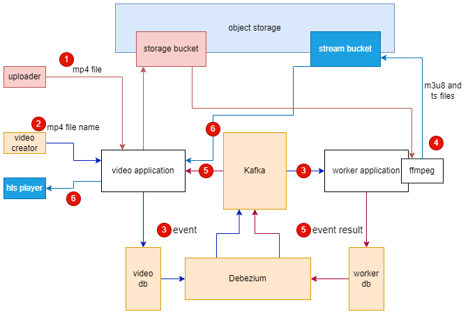

# spring-video

## Description

HLS video streaming application with Minio object storage, Kafka, Debezium and FFmpeg.

## Architecture



## Get Started

1. install ffmpeg


2. follow [this](https://github.com/joejoe2/spring-jwt-template)
   to setup an authentication service and run it at port 8080


3. run `docker-sompose up -d`


4. run commands in `./command.txt`


5. run the current project and worker project (at `./worker`)


6. goto http://localhost:8080/swagger-ui/index.html#/auth-controller/login and login to get an access token


7. goto http://localhost:8082/swagger-ui/index.html#/storage-controller/upload and upload a mp4 file


8. goto http://localhost:8082/swagger-ui/index.html#/video-controller/create and create a video with the filename in 7. , please copy the video id from response 


9. goto http://localhost:8082/swagger-ui/index.html#/video-controller/profile with video id and wait for the video status become READY


10. use http://localhost:8082/api/video/{your_video_id}/index.m3u8 for any HLS player

## Testing

run `mvn test` or `./mvnw test`

## Lint

run
```
mvn spotless:check
mvn spotless:apply
``` 
or
```
./mvnw spotless:check
./mvnw spotless:apply
``` 